# arduino-learning

Notes and resources for learning Arduino.

## Projects

Each project folder contains the sketch (`.ino`), a breadboard picture (`Circuits.png`) and a schematic (`Schematic.png`). Click a thumbnail to open the full-size image.

### Stage 1 — Digital I/O

| # | Project | What it shows | Circuit | Schematic |
|---|---------|---------------|---------|-----------|
| 01 | [Blink](stage1-digital-io/01_blink/) | Blinking an LED with `digitalWrite` and `delay` | <a href="stage1-digital-io/01_blink/Circuits.png">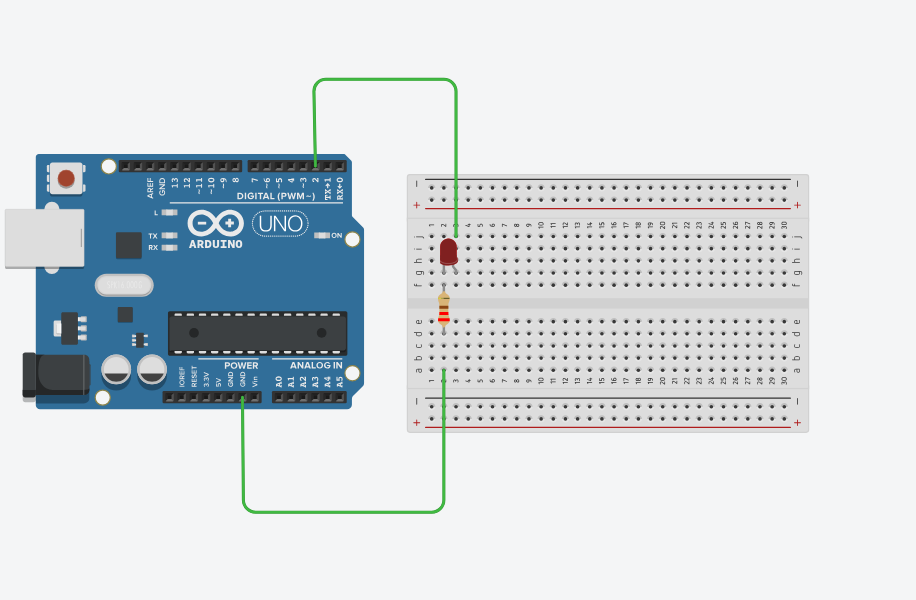</a> | <a href="stage1-digital-io/01_blink/Schematic.png">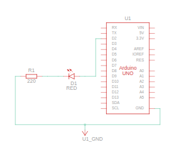</a> |
| 02 | [Traffic Light](stage1-digital-io/02_traffic_light/) | Controlling several LEDs in sequence | <a href="stage1-digital-io/02_traffic_light/Circuits.png">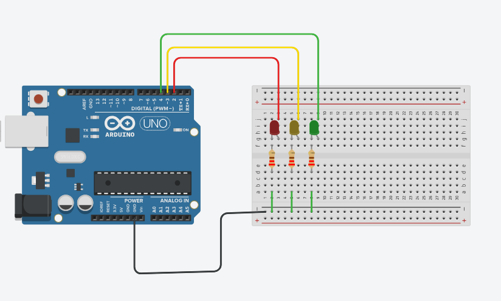</a> | <a href="stage1-digital-io/02_traffic_light/Schematic.png">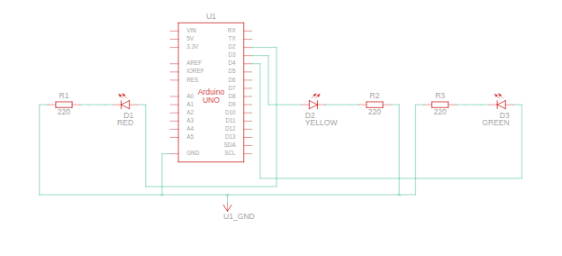</a> |
| 03 | [Button LED](stage1-digital-io/03_button_led/) | Toggling an LED with a button (`digitalRead`) | <a href="stage1-digital-io/03_button_led/Circuits.png">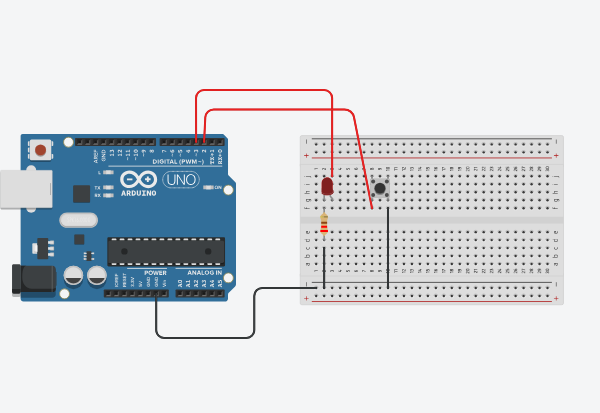</a> | <a href="stage1-digital-io/03_button_led/Schematic.png">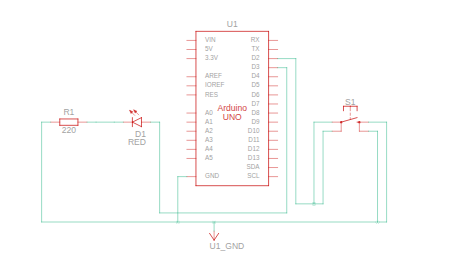</a> |
| 04 | [PWM Fade](stage1-digital-io/04_pwm_fade/) | Smooth LED fading with `analogWrite` (PWM) | <a href="stage1-digital-io/04_pwm_fade/Circuits.png">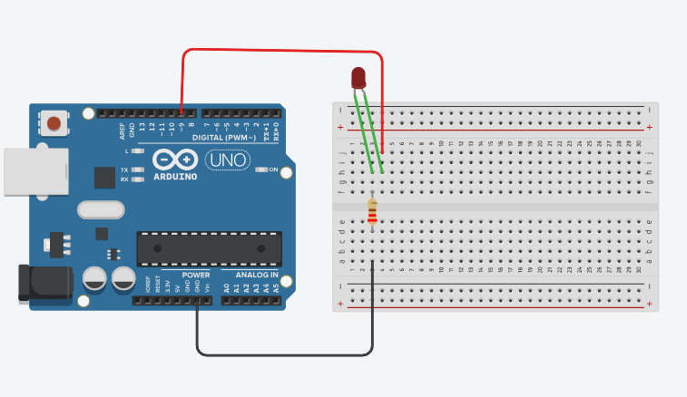</a> | <a href="stage1-digital-io/04_pwm_fade/Schematic.png">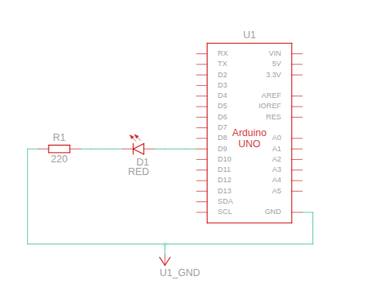</a> |
| 05 | [Buzzer Tones](stage1-digital-io/05_buzzer_tones/) | Playing notes, a siren and a melody with `tone` | <a href="stage1-digital-io/05_buzzer_tones/Circuits.png">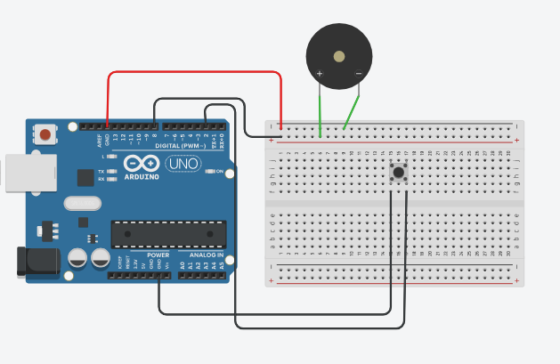</a> | <a href="stage1-digital-io/05_buzzer_tones/Schematic.png">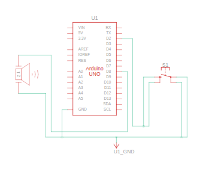</a> |

### Stage 2 — Analog Sensors

| # | Project | What it shows | Circuit | Schematic |
|---|---------|---------------|---------|-----------|
| 06 | [Pot Brightness](stage2-analog-sensors/06_pot_brightness/) | Reading a potentiometer with `analogRead` and `map` | <a href="stage2-analog-sensors/06_pot_brightness/Circuits.png">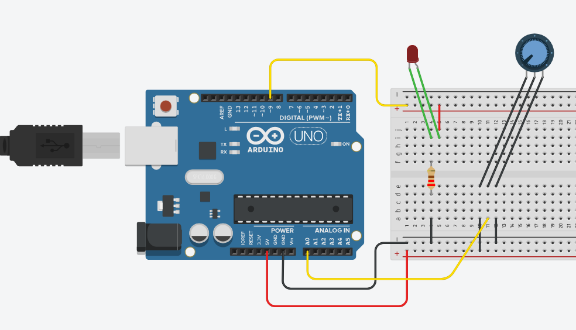</a> | <a href="stage2-analog-sensors/06_pot_brightness/Schematic.png">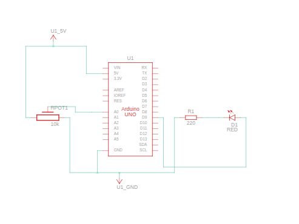</a> |
| 07 | [Night Light](stage2-analog-sensors/07_night_light/) | Turning on an LED in the dark with a photoresistor (LDR) | <a href="stage2-analog-sensors/07_night_light/Circuits.png">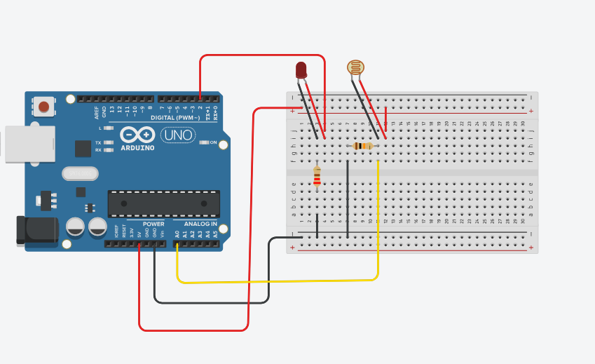</a> | <a href="stage2-analog-sensors/07_night_light/Schematic.png">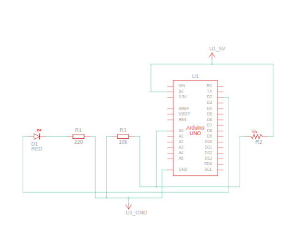</a> |

## Software

- [Arduino IDE](https://www.arduino.cc/en/software/) — official IDE for writing and uploading sketches

## Documentation

- [Arduino Language Reference](https://docs.arduino.cc/language-reference/) — functions, variables and structure
- [Arduino Built-in Examples](https://docs.arduino.cc/built-in-examples/) — ready-made sketches to start with

## Online Simulators

Try circuits without real hardware:

- [Tinkercad Circuits](https://www.tinkercad.com/circuits) — beginner-friendly, visual breadboard
- [Wokwi](https://wokwi.com) — fast simulator with support for many boards and sensors

## Linux: USB Port Permissions

If the IDE can't upload to the board (`Permission denied` on `/dev/ttyACM0` or `/dev/ttyUSB0`):

**Permanent fix (recommended)** — add your user to the `dialout` group, then log out and back in:

```bash
sudo usermod -aG dialout $USER
```

**Quick temporary fix** — resets after the board is reconnected or the system reboots:

```bash
sudo chmod a+rw /dev/ttyACM0
```

To find which port your board uses:

```bash
ls /dev/ttyACM* /dev/ttyUSB*
```
